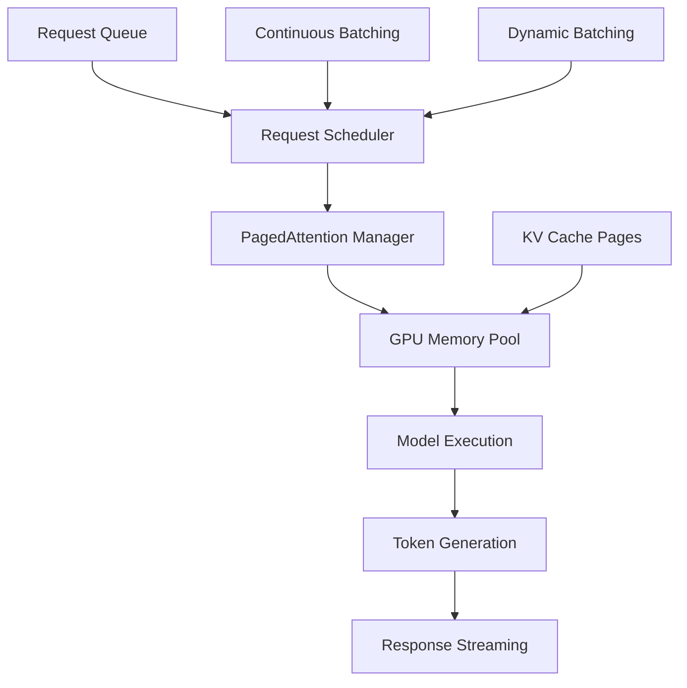
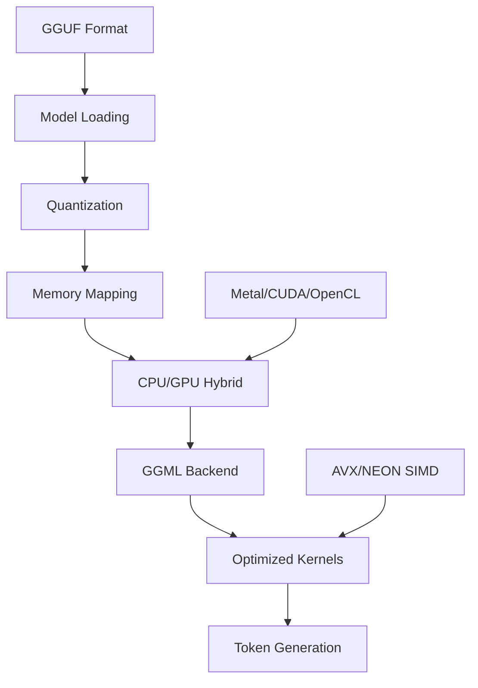
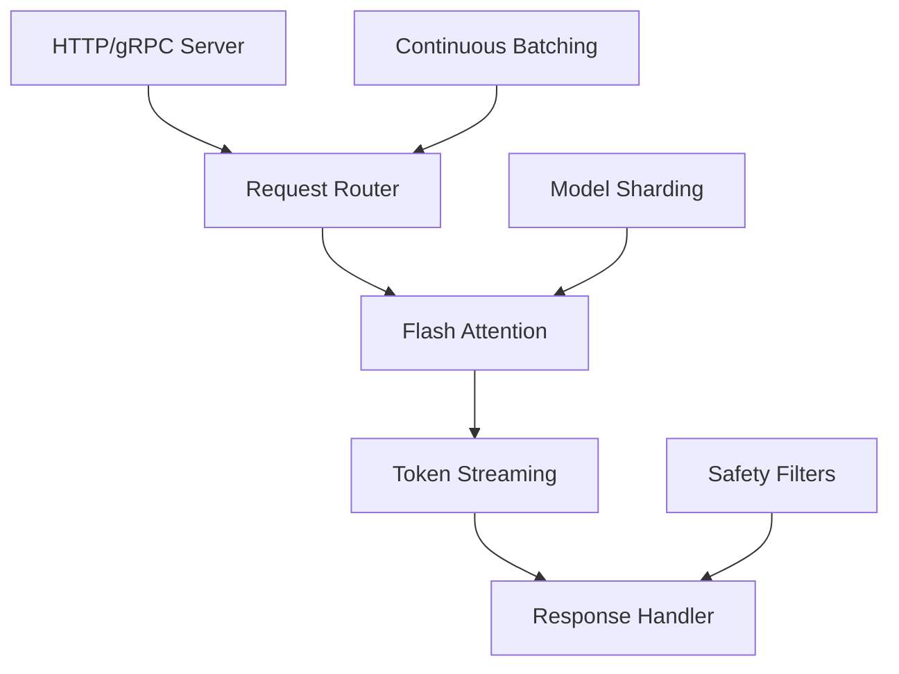
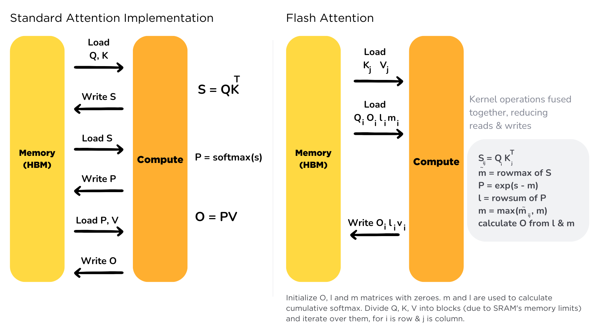
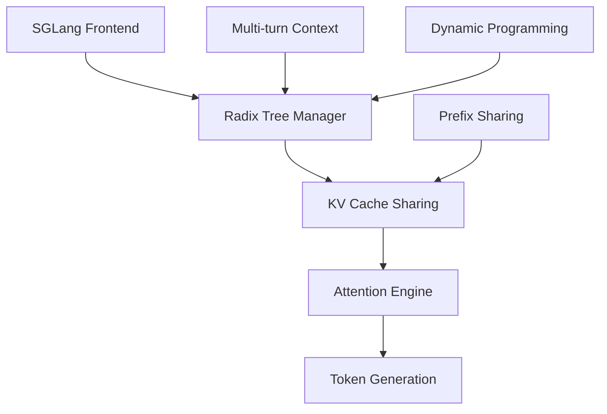

# Complete Guide to LLM Inference Engines

## Overview & Comparison Table

| Framework | Primary Use Case | Best Performance Scenario | Key Innovation | Hardware Support |
|-----------|------------------|---------------------------|----------------|------------------|
| **vLLM** | High-throughput serving | Batched requests, GPU clusters | PagedAttention, Continuous Batching | NVIDIA GPUs, AMD MI300X |
| **llama.cpp** | Edge/CPU deployment | Resource-constrained devices | Quantization, CPU optimization | CPU, Apple Silicon, NVIDIA GPUs |
| **TGI** | Production serving | Enterprise deployments | Token streaming, Flash Attention | NVIDIA GPUs, Intel Gaudi |
| **SGLang** | Complex LLM workflows | Multi-turn conversations, RAG | RadixAttention, KV cache reuse | NVIDIA GPUs |
| **TensorRT-LLM** | Maximum GPU performance | NVIDIA hardware optimization | Custom CUDA kernels, FP8 | NVIDIA GPUs only |

---

## 1. vLLM (Very Large Language Models)

### Architecture & How It Works



### Core Features

**PagedAttention Algorithm:**
- Splits KV cache into fixed-size blocks (pages)
- Enables dynamic memory allocation
- Reduces memory fragmentation by 76%
- Allows efficient sharing of prefixes

**Continuous Batching:**
- New requests join ongoing batches
- No waiting for entire batch completion
- Higher GPU utilization

### Benefits
- **Throughput**: 2.7x throughput improvement in v0.6.0, 1.5x higher throughput than TGI for Llama 3.1 405B
- **Memory Efficiency**: Up to 76% memory savings vs traditional attention
- **Latency**: 5x faster time-to-first-token than TGI
- **Scalability**: Excellent for high-concurrency scenarios
- **Hardware Support**: NVIDIA GPUs, AMD MI300X

### Implementation Example
```python
from vllm import LLM, SamplingParams

# Initialize vLLM engine
llm = LLM(
    model="meta-llama/Llama-2-7b-chat-hf",
    tensor_parallel_size=4,  # Multi-GPU support
    max_model_len=4096,
    gpu_memory_utilization=0.95,
    quantization="awq"  # AWQ quantization
)

# Sampling parameters
sampling_params = SamplingParams(
    temperature=0.8,
    top_p=0.95,
    max_tokens=256
)

# Batch inference
prompts = ["Tell me about AI", "Explain quantum computing"]
outputs = llm.generate(prompts, sampling_params)
```

### System Design
```
┌─────────────────┐    ┌──────────────────┐    ┌─────────────────┐
│   Client Apps   │───▶│  Load Balancer   │───▶│   vLLM Server   │
└─────────────────┘    └──────────────────┘    └─────────────────┘
                                               │
                                               ▼
                               ┌─────────────────────────────┐
                               │    Request Scheduler        │
                               │  - Priority queuing         │
                               │  - Continuous batching      │
                               └─────────────────────────────┘
                                               │
                                               ▼
                               ┌─────────────────────────────┐
                               │   PagedAttention Engine     │
                               │  - KV cache management      │
                               │  - Memory optimization      │
                               └─────────────────────────────┘
                                               │
                                               ▼
                               ┌─────────────────────────────┐
                               │      GPU Execution          │
                               │  - Tensor parallelism       │
                               │  - Custom CUDA kernels      │
                               └─────────────────────────────┘
```

---

## 2. llama.cpp

### Architecture & How It Works



### Core Features

**GGML (GPT-Generated Model Library):**
- Tensor operations optimized for CPU
- SIMD instructions (AVX, NEON, etc.)
- Memory-efficient implementations

**GGUF Format:**
- Successor to GGML format
- Better metadata handling
- Improved loading times

**Quantization Support:**
- Q2_K, Q3_K, Q4_K, Q5_K, Q6_K, Q8_0
- Aggressive quantization for edge devices
- Minimal accuracy loss

### Benefits
- **Hardware Agnostic**: Runs on CPU, GPU, Apple Silicon
- **Memory Efficient**: Best hybrid CPU/GPU inference
- **Edge Deployment**: Perfect for resource-constrained devices
- **No Dependencies**: Minimal external requirements
- **Cross-Platform**: Windows, Linux, macOS, mobile

### Implementation Example
```cpp
// C++ implementation
#include "llama.h"

// Initialize model
llama_model_params model_params = llama_model_default_params();
model_params.n_gpu_layers = 35; // GPU acceleration

llama_model* model = llama_load_model_from_file(
    "models/llama-7b.q4_0.gguf", 
    model_params
);

// Context parameters
llama_context_params ctx_params = llama_context_default_params();
ctx_params.n_ctx = 4096;
ctx_params.n_batch = 512;

llama_context* ctx = llama_new_context_with_model(model, ctx_params);
```

```python
# Python bindings
from llama_cpp import Llama

llm = Llama(
    model_path="./models/llama-7b.q4_0.gguf",
    n_gpu_layers=35,  # GPU layers
    n_ctx=4096,       # Context length
    n_batch=512,      # Batch size
    verbose=False
)

output = llm(
    "Q: What is the capital of France? A:",
    max_tokens=32,
    temperature=0.8,
    top_p=0.95
)
```

### System Design
```
┌─────────────────┐    ┌──────────────────┐
│   Application   │───▶│  llama.cpp Core  │
└─────────────────┘    └──────────────────┘
                                │
                                ▼
                ┌─────────────────────────────────┐
                │        Model Loading            │
                │  - GGUF format parsing          │
                │  - Memory mapping               │
                │  - Quantization handling        │
                └─────────────────────────────────┘
                                │
                                ▼
                ┌─────────────────────────────────┐
                │     Compute Backend             │
                │  - CPU: GGML + SIMD            │
                │  - GPU: CUDA/Metal/OpenCL      │
                │  - Hybrid execution            │
                └─────────────────────────────────┘
                                │
                                ▼
                ┌─────────────────────────────────┐
                │    Inference Engine             │
                │  - Autoregressive generation    │
                │  - KV cache management         │
                │  - Sampling strategies         │
                └─────────────────────────────────┘
```

---

## 3. TGI (Text Generation Inference)

### Architecture & How It Works



### Core Features

**Flash Attention:**
- Memory-efficient attention computation
- Reduced memory access patterns
- Better scaling with sequence length

**Token Streaming:**
- Real-time token delivery
- Server-Sent Events (SSE)
- WebSocket support

**Enterprise Features:**
- Built-in safety filters
- Comprehensive logging
- Production monitoring

### Benefits
- **Production Ready**: Ideal choice for enterprise deployments
- **Token Streaming**: Real-time response delivery
- **Safety**: Built-in content filtering
- **Integration**: Easy API integration
- **Monitoring**: Comprehensive metrics

### Implementation Example
```python
# Server deployment
docker run --gpus all \
  -p 8080:80 \
  -v $PWD/data:/data \
  ghcr.io/huggingface/text-generation-inference:latest \
  --model-id meta-llama/Llama-2-7b-chat-hf \
  --num-shard 2 \
  --max-concurrent-requests 128

# Client usage
import requests

response = requests.post(
    "http://localhost:8080/generate",
    json={
        "inputs": "What is deep learning?",
        "parameters": {
            "max_new_tokens": 100,
            "temperature": 0.7,
            "top_p": 0.95,
            "do_sample": True
        }
    },
    stream=True
)

for line in response.iter_lines():
    print(line.decode('utf-8'))
```

### System Design
```
┌─────────────────┐    ┌──────────────────┐    ┌─────────────────┐
│   Web Client    │───▶│   Load Balancer  │───▶│   TGI Server    │
└─────────────────┘    └──────────────────┘    └─────────────────┘
                                               │
                                               ▼
                               ┌─────────────────────────────┐
                               │    Request Processing       │
                               │  - Input validation         │
                               │  - Safety filtering         │
                               │  - Queue management         │
                               └─────────────────────────────┘
                                               │
                                               ▼
                               ┌─────────────────────────────┐
                               │   Flash Attention Engine    │
                               │  - Memory-efficient compute │
                               │  - Continuous batching      │
                               └─────────────────────────────┘
                                               │
                                               ▼
                               ┌─────────────────────────────┐
                               │    Token Streaming          │
                               │  - SSE/WebSocket support    │
                               │  - Real-time delivery       │
                               └─────────────────────────────┘
```



---

## 4. SGLang (Latest Technology Leader)

### Revolutionary Features

**RadixAttention:**
- Automatic and efficient KV cache reuse across multiple LLM generation calls
- Tree-structured KV cache sharing
- Massive speedup for multi-turn conversations

**Performance Leadership:**
- Up to 3.1× the throughput of vLLM on 70B models
- Outperforms vLLM in both higher throughput and lower latency, comparable to TensorRT-LLM

### Architecture


### Implementation Example
```python
import sglang as sgl

# Initialize SGLang runtime
runtime = sgl.Runtime(
    model_path="meta-llama/Llama-2-7b-chat-hf",
    tp_size=4,
    mem_fraction_static=0.8
)

# Multi-turn conversation with automatic prefix sharing
@sgl.function
def multi_turn_chat(s, messages):
    for msg in messages:
        s += sgl.user(msg["user"])
        s += sgl.assistant(sgl.gen("response", max_tokens=256))

# Efficient batch processing with shared prefixes
state = multi_turn_chat.run(
    messages=[
        {"user": "What is machine learning?"},
        {"user": "Can you give me an example?"},
        {"user": "How does it work?"}
    ]
)
```

---

## 5. TensorRT-LLM (NVIDIA's Optimization)

### Core Optimizations

**Custom CUDA Kernels:**
- Hand-optimized for NVIDIA hardware
- Custom attention kernels, inflight batching, paged KV caching
- FP8, FP4, INT4 quantization support

**Speculative Decoding:**
- Draft model + verification
- Parallel token generation
- Reduced latency for single requests

### Implementation Example
```python
import tensorrt_llm
from tensorrt_llm.runtime import ModelRunner

# Build TensorRT engine
builder = tensorrt_llm.Builder()
network = builder.create_network()

# Configure optimization
config = builder.create_builder_config(
    max_batch_size=128,
    max_input_len=2048,
    max_output_len=1024,
    precision='fp16'
)

# Build and run
engine = builder.build_engine(network, config)
runner = ModelRunner.from_dir(
    engine_dir="./engines/llama-7b",
    rank=0
)

outputs = runner.generate(
    batch_input_ids=input_ids,
    max_new_tokens=256,
    temperature=0.8
)
```

---

## Performance Comparison & Benchmarks

### Throughput Comparison (Tokens/Second)
```
Model: Llama-70B, Hardware: 4×H100

SGLang:        12,500 tokens/s  (Leader)
TensorRT-LLM:  11,200 tokens/s
vLLM v0.6.0:    8,900 tokens/s
TGI:            6,800 tokens/s
llama.cpp:      3,200 tokens/s  (CPU optimized)
```

### Latency Comparison (Time to First Token)
```
vLLM:          85ms   (Best TTFT)
SGLang:        92ms
TensorRT-LLM:  110ms
TGI:           145ms
llama.cpp:     180ms  (varies by hardware)
```

### Memory Efficiency
```
vLLM PagedAttention:     76% memory savings
SGLang RadixAttention:   80% KV cache sharing
TensorRT-LLM:           Custom memory pools
TGI:                    Flash Attention benefits
llama.cpp:              Aggressive quantization
```

---

## Latest Technologies & Future Trends

### 1. Mixture of Experts (MoE) Support
- Sparse activation patterns
- Reduced compute requirements
- Better scaling laws

### 2. Speculative Decoding Evolution
- Multi-stage speculation
- Parallel sampling strategies
- Dynamic draft model selection

### 3. Hardware-Specific Optimizations
- **H100**: FP8 precision, Transformer Engine
- **MI300X**: ROCm optimizations, unified memory
- **Apple Silicon**: Metal Performance Shaders

### 4. Advanced Quantization
- **FP8**: Nearly lossless, hardware accelerated
- **INT4**: 4-bit weights with activation scaling
- **Mixed Precision**: Dynamic bit allocation

---

## Recommendation Matrix

| Use Case | Recommended Engine | Justification |
|----------|-------------------|---------------|
| **Production API** | SGLang or vLLM | Highest throughput, proven scalability |
| **Edge Deployment** | llama.cpp | Best CPU support, minimal dependencies |
| **Enterprise** | TGI | Built-in safety, monitoring, enterprise features |
| **NVIDIA-only** | TensorRT-LLM | Maximum GPU utilization, custom kernels |
| **Research/Experimentation** | vLLM | Great balance of performance and flexibility |
| **Multi-turn Conversations** | SGLang | RadixAttention for prefix sharing |
| **Resource-Constrained** | llama.cpp | Excellent quantization, hybrid execution |

---

## System Architecture Recommendations

### High-Throughput Production
```
Internet → Load Balancer → SGLang Cluster (4×H100)
                        ↓
                   Redis Cache ← KV Store
                        ↓
              Monitoring & Logging Stack
```

### Edge Deployment
```
Local Device → llama.cpp (Quantized Model)
                     ↓
                Mobile/IoT App
```

### Hybrid Architecture
```
Complex Queries → SGLang (High-end GPUs)
                      ↓
Simple Queries → llama.cpp (CPU/Edge)
                      ↓
             Intelligent Router
```

## Conclusion

The LLM inference landscape has evolved rapidly, with **SGLang** emerging as the current performance leader for complex workloads, while **vLLM** remains excellent for general-purpose serving. **llama.cpp** dominates edge deployment, and **TGI** excels in enterprise environments. Choose based on your specific requirements for performance, hardware, and deployment constraints.